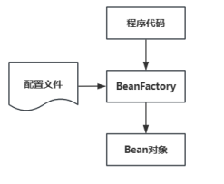
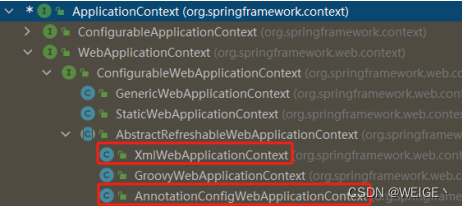

传统的Java程序代码通常将对象的构建、接口的实现以及业务的实现紧密的耦合在一起，不利于代码的扩展性。为了解决了传统Java程序代码的紧密耦合问题。Spring提出了IoC（Inversion of control：即控制反转）的设计思想，将原本在程序中手动创建对象的控制权、对象之间的相互依赖关系交给 IoC 容器来管理，并由IoC容器完成对象的依赖注入。这样即实现了对象之间的松耦合，使程序的的可读性和扩展性大大提升，又在可以很大程度上简化应用的开发。


<!-- more -->

## 1.IoC与DI思想的提出

- Spring 通过IoC容器来管理所有Java对象的实例化和初始化，控制对象与对象之间的依赖关系。我们将由IoC容器管理的Java对象称为Spring Bean，Spring使用工厂设计模式，通过BeanFactory的方式已经实现的"控制反转"，将Bean的创建权交给了BeanFactory。



- Spring创建对象的过程中，将对象属性、依赖关系通过配置进行注入。这被称为DI（Dependency Injection）依赖注入。常见的两种注入方式为：Set方式注入和构造函数注入。
- IoC与DI的关系：
  - 第一种观点是IoC强调的是Bean创建权的反转，而DI强调的是Bean的依赖关系。
  - 第二种观点：IoC强调的是Bean创建权的反转，而DI强调的是通过注入的方式反转Bean的创建权，认为DI是IoC的其中一种实现方式。

## 2.BeanFactory详解

​      上面讲到，Spring IoC将Bean的控制权交给BeanFactory进行管理和依赖注入，BeanFactory直译为Bean的生产工厂。BeanFactory是Spring最高级抽象的接口，是工厂模式的实现，允许通过创建和检索对象，即生产Bean。

- BeanFactory支持单例模型（singleton）和原型模型（prototype）两种对象对象模型管理对象。
  1. 单例模型：Spring容器创建的时候，就会进行Bean的实例化，并存储到容器内部的单例池中，进行全局共享。每次获取Bean时都是从单例池中获取相同的Bean实例；
  1. 原型模型：Spring容器初始化时不会创建Bean实例，当每次获取Bean时才会实例化Bean，每次获取Bean都会创建一个新的Bean实例。


> BeanFactory默认Bean管理模型为单例模式。

- BeanFactory的继承关系如下图所示，BeanFactory有三个重要的子类：ListableBeanFactory、HierarchicalBeanFactory、AbstractAutowireCapbleBeanFactory。DefaultListableBeanFactory是其最终的实现，实现了所有的接口。
  1. ListableBeanFactory接口，表示Bean列表化
  2. HierarchicalBeanFactory接口，表示Bean继承关系
  3. AbstractAutowireCapbleBeanFactory接口，定义了Bean的自动装配规则


> 这三个接口共同定义了Bean的集合、Bean之间的关系以及Bean的行为

BeanFactory加载配置文件的示例代码如下：

```java
DefaultListableBeanFactory beanFactory = new DefaultListableBeanFactory();
//创建读取器
XmlBeanDefinitionReader reader = new XmlBeanDefinitionReader(beanFactory);
//加载配置文件
reader.loadBeanDefinitions("beans.xml");
UserService userService = (UserService) beanFactory.getBean("userService");
```

- ApplicationContext称为Spring容器，内部封装了BeanFactory，比BeanFactory功能更丰富更强大，ApplicationContext除了继承了BeanFactory外，还继承了ApplicationEventPublisher（事件发布器）、ResouresPatternResolver（资源解析器）、MessageSource（消息资源）等。但是ApplicationContext的核心功能还是BeanFactory。其继承关系如下图 ：


-  ApplicationContext和BeanFactory之间的关系：
  1. BeanFactory是Spring的早期接口，称为Spring的Bean工厂，ApplicationContext是后期更高级接口，称之为Spring容器；
  1. ApplicationContext在BeanFactory基础上对功能进行了扩展，例如：监听功能、国际化功能等。BeanFactory的 API更偏向底层，ApplicationContext的API大多数是对这些底层API的封装；
  1. Bean创建的主要逻辑和功能都被封装在BeanFactory中，ApplicationContext不仅继承了BeanFactory，而且 ApplicationContext内部还维护着BeanFactory的引用，所以，ApplicationContext与BeanFactory既有继承关系，又有融合关系。
  1. Bean的初始化时机不同，原始BeanFactory是在首次调用getBean时才进行Bean的创建，而ApplicationContext则是配置文件加载，容器一创建就将Bean都实例化并初始化好。


​    在Spring环境中，ApplicationContext常用的实现类为：ClassPathXmlApplicationContext、FileSystemXmlApplicationContext和AnnotationConfigApplicationContext。


1. ClassPathXmlApplicationContext：加载类路径下的xml配置的ApplicationContext
2. FileSystemXmlApplicationContext：加载磁盘路径下的xml配置的ApplicationContext
3. AnnotationConfigApplicationContext：加载注解配置类的ApplicationContext

​    在Spring Web环境中，ApplicationContext常用的实现类为：XmlWebApplicationContext和AnnotationConfigWebApplicationContext。




​    XmlWebApplicationContext：web环境下，加载类路径下的xml配置的ApplicationContext。AnnotationConfigWebApplicationContext：web环境下，加载磁盘路径下的xml配置的ApplicationContext。

ApplicationContext加载配置文件的示例代码如下：

```java
ApplicationContext applicationContext = new ClassPathXmlApplicationContext("applicationContext.xml");
UserDao userDao = (UserDao) applicationContext.getBean("userDao");
```


## 3.Bean的生产流程详解

- Spring容器在进行初始化时，会将xml配置的\<bean>标签的信息封装成一个BeanDefinition对象，然后将所有的BeanDefinition存储到一个名为beanDefinitionMap的Map集合中，Spring框架再对beanDefinitionMap进行遍历，使用反射创建Bean实例对象，创建好的Bean对象存储在一个名为singletonObjects的Map集合中，当调用getBean方法时则最终从该Map集合中取出Bean实例对象返回。

- DefaultListableBeanFactory对象内部维护着一个Map集合用于存储封装好的BeanDefinitionMap，Spring框架会取出beanDefinitionMap中的每个BeanDefinition信息，通过反射构造方法或调用指定的工厂方法生成Bean实例对象，所以只要将BeanDefinition注册到beanDefinitionMap这个Map中，Spring就会进行对应的Bean的实例化操作，然后将Bean存储到单例池singletonObjects中，在DefaultListableBeanFactory的父类DefaultSingletonBeanRegistry中，维护着singletonObjects。Bean实例化的基本流程如下图所示。


- Spring提供后处理器，我们可以介入到Bean的整个实例化流程中来，以达到动态注册BeanDefinition、动态修改BeanDefinition以及动态修改Bean的作用。Spring主要有两种后处理器：

  1. BeanFactoryPostProcessor：Bean工厂后处理器，在BeanDefinitionMap填充完毕，Bean实例化之前执行；

  2. BeanPostProcessor：Bean后处理器，一般在Bean实例化之后，填充到单例池singletonObjects之前执行。

- Bean工厂后处理器（BeanFactoryPostProcessor）是一个接口规范，实现了该接口的类只要交由Spring容器管理的话，那么Spring就会回调该接口的方法，用于对BeanDefinition注册和修改的功能。

```java
public interface BeanFactoryPostProcessor {

    void postProcessBeanFactory(ConfigurableListableBeanFactory beanFactory);

}

public class MyBeanFactoryPostProcessor implements BeanFactoryPostProcessor {

    public void postProcessBeanFactory(ConfigurableListableBeanFactory beanFactory) throws BeansException {

        //获得UserDao定义对象

        BeanDefinition userDaoBD = beanFactory.getBeanDefinition(“userDao”);

        //修改class  

        userDaoBD.setBeanClassName("org.example.Dao.UserDaoImpl");

        //修改初始化方法

        //userDaoBD.setInitMethodName(methodName);

        //修改是否懒加载

        //userDaoBD.setLazyInit(true); }

}
```

- postProcessBeanFactory 参数本质就是 DefaultListableBeanFactory，拿到BeanFactory的引用，自然就可以 对beanDefinitionMap中的BeanDefinition进行操作了。

- Spring 提供了一个BeanFactoryPostProcessor的子接口BeanDefinitionRegistryPostProcessor专门用于BeanDefinition的注册操作

```java
public class MyBeanFactoryPostProcessor2 implements BeanDefinitionRegistryPostProcessor {

    @Override

    public void postProcessBeanFactory(ConfigurableListableBeanFactory configurableListableBeanFactory) throws BeansException {}

    @Override

    public void postProcessBeanDefinitionRegistry(BeanDefinitionRegistry beanDefinitionRegistry) throws BeansException {

    	BeanDefinition beanDefinition = new RootBeanDefinition();

    	beanDefinition.setBeanClassName("org.example.Dao.UserDaoImpl2");

    	beanDefinitionRegistry.registerBeanDefinition("userDao2",beanDefinition);

    }

}
```


- Bean后处理器（BeanPostProcessor），Bean被实例化后，到最终缓存到名为singletonObjects单例池之前，中间会经过Bean的初始化过程，例如：属性的填充、初始方法init的执行等，其中有一个对外进行扩展的点BeanPostProcessor，我们称为Bean后处理。跟上面Bean工厂后处理器相似，它也是一个接口，实现了该接口并被容器管理的BeanPostProcessor，会在流程节点上被Spring自动调用。 BeanPostProcessor的接口定义如下：

```java
public interface BeanPostProcessor {

    @Nullable

    //在属性注入完毕，init初始化方法执行之前被回调

    default Object postProcessBeforeInitialization(Object bean, String beanName) throws BeansException {

    		return bean;

    }

    @Nullable

//在初始化方法执行之后，被添加到单例池singletonObjects之前被回调

    default Object postProcessAfterInitialization(Object bean, String beanName) throws BeansException {

   	 		return bean;

    }

}
```


## 4.Bean的生命周期详解

- Spring Bean的生命周期是从 Bean 实例化之后，即通过反射创建出对象之后，到Bean成为一个完整对象，最终存储 到单例池中，这个过程被称为Spring Bean的生命周期。Spring Bean的生命周期大体上分为三个阶段：
  - Bean的实例化阶段：Spring框架会取出BeanDefinition的信息进行判断当前Bean的范围是否是singleton的，是否不是延迟加载的，是否不是FactoryBean等，最终将一个普通的singleton的Bean通过反射进行实例化。
  - Bean的初始化阶段：Bean创建之后还仅仅是个"半成品"，还需要对Bean实例的属性进行填充、执行一些Aware接口方法、执行BeanPostProcessor方法、执行InitializingBean接口的初始化方法、执行自定义初始化init方法等。
  - Bean的完成阶段：经过初始化阶段，Bean就成为了一个完整的Spring Bean，被存储到单例池 singletonObjects中去了，即完成了Spring Bean的整个生命周期。


- Spring Bean的初始化过程涉及如下几个过程：
  - Bean实例的属性填充：BeanDefinition 中有对当前Bean实体的注入信息通过属性propertyValues进行了存储， 
  - Aware接口属性注入 
  - BeanPostProcessor的before()方法回调 
  - InitializingBean接口的初始化方法回调
  - 自定义初始化方法init回调 
  - BeanPostProcessor的after()方法回调


- Spring在进行属性注入时，会分为如下几种情况：  
  - 注入普通属性，String、int或存储基本类型的集合时，直接通过set方法的反射设置进去。 
  - 注入单向对象引用属性时，从容器中getBean获取后通过set方法反射设置进去，如果容器中没有，则先创建被 注入对象Bean实例（完成整个生命周期）后，在进行注入操作。
  - 注入双向对象引用属性时，就比较复杂了，涉及了循环依赖问题。

> Spring提供了三级缓存存储 完整Bean实例 和 半成品Bean实例 ，用于解决循环依赖问题

在DefaultListableBeanFactory的上四级父类DefaultSingletonBeanRegistry中提供如下三个Map：

```java
public class DefaultSingletonBeanRegistry ... {

    //1、最终存储单例Bean成品的容器，即实例化和初始化都完成的Bean，称之为"一级缓存"

    Map<String, Object> singletonObjects = new ConcurrentHashMap(256);

    //2、早期Bean单例池，缓存半成品对象，且当前对象已经被其他对象引用了，称之为"二级缓存"

    Map<String, Object> earlySingletonObjects = new ConcurrentHashMap(16);

    //3、单例Bean的工厂池，缓存半成品对象，对象未被引用，使用时在通过工厂创建Bean，称之为"三级缓存"

    Map<String, ObjectFactory<?>> singletonFactories = new HashMap(16);

}
```


**解决循环依赖的解决过程描述如下：**

1. 对象A实例化，但尚未初始化，将对象A存储到三级缓存； 
2. 对象A 属性注入，需要对象B，从缓存中获取，没有对象B； 
3. 对象B实例化对象，但尚未初始化，将对象B存储到到三级缓存； 
4. 对象B属性注入，需要对象A，从三级缓存获取对象A，对象A从三级缓存移入二级缓存； 
5. 对象B执行其他生命周期过程，最终成为一个完成Bean，存储到一级缓存，删除二三级缓存； 
6. 对象A注入对象B； 
7. 对象A行其他生命周期过程，最终成为一个完成Bean，存储到一级缓存，删除二三级缓存。

​    Aware接口是一种框架辅助属性注入的一种思想，框架具备高度封装性，我们接 触到的一般都是业务代码，一个底层功能API不能轻易的获取到，如果用到了，就可以使用框架提供的类似Aware的接口，让框架给我们注入该对象。

## 5.Spring IoC整体流程总结


1. BeanDefinition阶段：1.读取配置封装BeanDefinition，2.将BeanDefinition存储到BeanDefinitionMap，3.执行Bean工厂后处理器
2. Bean实例化阶段：Bean实例化了，但是未执行属性填充等生命周期过程，所以是个“半成品”。
3. Bean初始化阶段：该阶段对Bean进行生命周期过程执行，Spring大多数功能增强，例如注解解析、AOP都是在此完成的。
4. Bean存储阶段：实例化好并初始化好的Bean存储到单例池singletonObjects中。