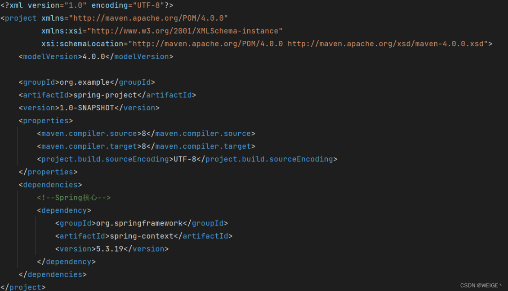

通过注解方式实现Spring IoC应用快速上手


<!-- more -->

## 1. 快速上手
### 第一步：Maven导入Spring坐标
首先，在pom.xml文件中配置Spring-context坐标，这边以5.3.19版本为例。

```xml
 <dependencies>
        <!--Spring核心-->
        <dependency>
            <groupId>org.springframework</groupId>
            <artifactId>spring-context</artifactId>
            <version>5.3.19</version>
     </dependency>
 </dependencies>
```



### 第二步：定义Bean的对象

如下图，以UseDao和UseService为例，创建其接口和实现类。		


分别在UserDaoImpl和DaoImpl在构造函数中添加如下代码，以验证其对象已经创建。
```java
public class UserDaoImpl implements UserDao {
    public UserDaoImpl() {
        System.out.println("UserDaoImpl创建了...");
    }
}

public class UserServiceImpl implements UserService {
    public UserServiceImpl() {
        System.out.println("UserServiceImpl创建了...");
    }

}
```
### 第三步：注解标注对象

```java
//获取方式：applicationContext.getBean("userDao");
@Component("userDao")
public class UserDaoImpl implements UserDao  {
    public UserDaoImpl() {
        System.out.println("UserDaoImpl创建了...");
    }
}


//获取方式：applicationContext.getBean("userDaoImpl");
@Component
public class UserServiceImpl implements UserService {
    public UserServiceImpl() {
        System.out.println("UserDaoImpl创建了...");
    }
}
```
**@Component注解的value属性指定当前Bean实例的beanName，也可以省略不写，不写的情况下为当前类名首字母小写**

### 第四步：配置组件扫描路径

在Resouse目录下创建Bean的配置文件，如下图所示分别创建了Bean.xml和ApplicationContext.xml文件，他们分别对应是BeanFacory和ApplicationContext的配置文件，两者功能一样。至于BeanFactory和ApplicationContext的关系上文做了详细的回答，[[点我，看详解答！！！](spring2.md)](https://blog.csdn.net/zw351833699/article/details/134586513)

**配置组件扫描路径**

```xml
<?xml version="1.0" encoding="UTF-8"?>
<beans xmlns="http://www.springframework.org/schema/beans"
       xmlns:xsi="http://www.w3.org/2001/XMLSchema-instance"
       xmlns:context="http://www.springframework.org/schema/context"
       xsi:schemaLocation="http://www.springframework.org/schema/beans http://www.springframework.org/schema/beans/spring-beans.xsd http://www.springframework.org/schema/context https://www.springframework.org/schema/context/spring-context.xsd">

    <context:component-scan base-package="org.example"/>
</beans>
```
## 2. Bean注解开发详解

### 2.1 常用注解开发

- @Component：被该注解标识的类，会在指定扫描范围内被Spring加载并实例化，相当于xml方式的\<bean id="" class="">标签
- @Scope：在类上或使用了@Bean标注的方法上，标注Bean的作用范围，取值为singleton或prototype，相当于xml方式的\<bean id="" class="" scope="">标签
- @Lazy：在类上或使用了@Bean标注的方法上，标注Bean是否延迟加载，取值为true和false，相当于xml方式的\<bean id="" class="" lazy-init="">标签
- @PostConstruct：在方法上使用，标注Bean的实例化后执行的方法，相当于xml方式的\<bean id=“” class=“” init-method="">标签
- @PreDestroy：在方法上使用，标注Bean的销毁前执行方法,\<bean id=“” class=“” destroy-method="">标签
```java
@Component("userDao")
@Scope("singleton")
@Lazy(true)
public class UserDaoImpl implements UserDao{
	@PostConstruct
	public void init(){}
	@PreDestroy
	public void destroy(){}
}
```
为了每层Bean标识的注解语义化更加明确，@Component衍生出如下三个注解，与@Component功能相同
- @Repository：在Dao层类上使用
- @Service：在Service层类上使用
- @Controller：在Web层类上使用
```java
@Repository("userDao")
public class UserDaoImpl implements UserDao{}
@Service("userService")
public class UserServiceImpl implements UserService{}
@Controller("userService")
public class UserController {}
```
### 2.2 依赖注入的注解开发

Bean依赖注入的注解，主要是使用注解的方式替代xml的\<property> 标签完成属性的注入操作。

```xml
<bean id="" class="">
	<property name="" value=""/>
	<property name="" ref=""/>
</bean>
```
Spring主要提供如下注解，用于在Bean内部进行属性注入的：
- @Value：使用在字段或方法上，用于注入普通数据
```java
@Value("weige")
private String username;
@Value("weige")
public void setUsername(String username){
	System.out.println(username);
}
```
- @Autowired：使用在字段或方法上，用于根据类型（byType）注入引用数据
```java
@Autowired
private UserDao userDao;
//使用在方法上直接注入
@Autowired
public void setUserDao(UserDao userDao){
System.out.println(userDao);
}
```
- @Qualifier：使用在字段或方法上，结合@Autowired，根据名称注入
```java
@Autowired
@Qualifier("userDao2")
private UserDao userDao;
@Autowired
@Qualifier("userDao2")
public void setUserDao(UserDao userDao){
System.out.println(userDao);
}
```
- @Resource：使用在字段或方法上，根据类型或名称进行注入，无参就是根据类型注入，有参数就是根据名称注入
```java
@Resource
private UserDao userDao;
@Resource(name = "userDao2")
public void setUserDao(UserDao userDao){
System.out.println(userDao);
}
```
### 2.3 非自定义Bean注解开发
非自定义Bean不能像自定义Bean一样使用@Component进行管理，非自定义Bean要通过工厂的方式进行实例化，使用@Bean标注方法即可，@Bean的属性为beanName，如不指定为当前工厂方法名称，工厂方法所在类必须要被Spring管理
```java
//将方法返回值Bean实例以@Bean注解指定的名称存储到Spring容器中
@Bean("dataSource")
public DataSource dataSource(){
	DruidDataSource dataSource = new DruidDataSource();
	dataSource.setDriverClassName("com.mysql.jdbc.Driver");
	dataSource.setUrl("jdbc:mysql://localhost:3306/demo");
	dataSource.setUsername("root");
	dataSource.setPassword("root");
	return dataSource;
}
```
如果@Bean工厂方法需要参数的话，则有如下几种注入方式：
- 使用@Autowired 根据类型自动进行Bean的匹配，@Autowired可以省略 ；
- 使用@Qualifier 根据名称进行Bean的匹配；
- 使用@Value 根据名称进行普通数据类型匹配。

```java
@Bean
@Autowired //根据类型匹配参数
public Object objectDemo01(UserDao userDao){
	System.out.println(userDao);
	return new Object();
}
@Bean
public Object objectDemo02(@Qualifier("userDao") UserDao userDao,
@Value("${jdbc.username}") String username){
	System.out.println(userDao);
	System.out.println(username);
	return new Object();
}
```
### 2.4 Bean配置类的注解开发
@Component等注解替代了\<bean>标签，但是像\<import>、\<context:componentScan> 等非\<bean> 标签怎样去使用注解替代呢？
```xml
<!-- 加载properties文件 -->
<context:property-placeholder location="classpath:jdbc.properties"/>
<!-- 组件扫描 -->
<context:component-scan base-package="org.example"/>
<!-- 引入其他xml文件 -->
<import resource="classpath:beans.xml"/>
```
- @Configuration注解标识的类为配置类，替代原有xml配置文件，该注解第一个作用是标识该类是一个配置类，第二个作用是具备@Component作用
- @ComponentScan 组件扫描配置，替代原有xml文件中的\<context:component-scan base-package=""/>
- @PropertySource 注解用于加载外部properties资源配置，替代原有xml中的 \<context:property-placeholder location=“”/> 配置
- @Import 用于加载其他配置类，替代原有xml中的\<import resource=“classpath:beans.xml”/>配置
```java
@Configuration
@ComponentScan({"com.itheima.service","com.itheima.dao"})
@PropertySource({"classpath:jdbc.properties","classpath:xxx.properties"})
@Import(OtherConfig.class)
public class ApplicationContextConfig {}
```
### 2.5 Spring 配置其他注解开发
- @Primary注解用于标注相同类型的Bean优先被使用权，@Primary 是Spring3.0引入的，与@Component和@Bean一起使用，标注该Bean的优先级更高，则在通过类型获取Bean或通过@Autowired根据类型进行注入时，会选用优先级更高的
```java
@Repository("userDao")
public class UserDaoImpl implements UserDao{}
@Repository("userDao2")
@Primary
public class UserDaoImpl2 implements UserDao{}


@Bean
public UserDao userDao01(){return new UserDaoImpl();}
@Bean
@Primary
public UserDao userDao02(){return new UserDaoImpl2();}
```
- @Profile 注解的作用同于xml配置时学习profile属性，是进行环境切换使用的
- 注解 @Profile 标注在类或方法上，标注当前产生的Bean从属于哪个环境，只有激活了当前环境，被标注的Bean才能被注册到Spring容器里，不指定环境的Bean，任何环境下都能注册到Spring容器里。
  - 使用命令行动态参数，虚拟机参数位置加载 -Dspring.profiles.active=test	
  - 使用代码的方式设置环境变量 System.setProperty("spring.profiles.active","test");
```java
@Repository("userDao")
@Profile("test")
public class UserDaoImpl implements UserDao{}
@Repository("userDao2")
public class UserDaoImpl2 implements UserDao{}
```
