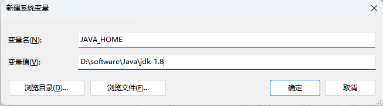
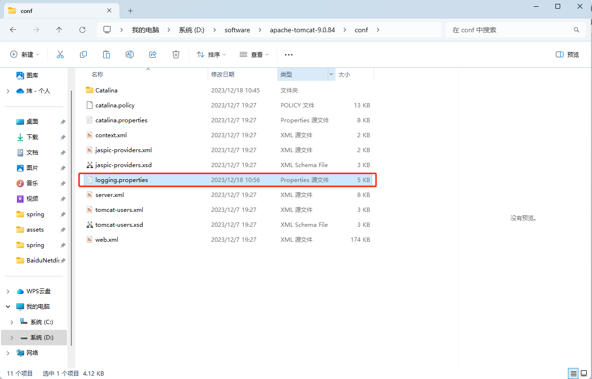
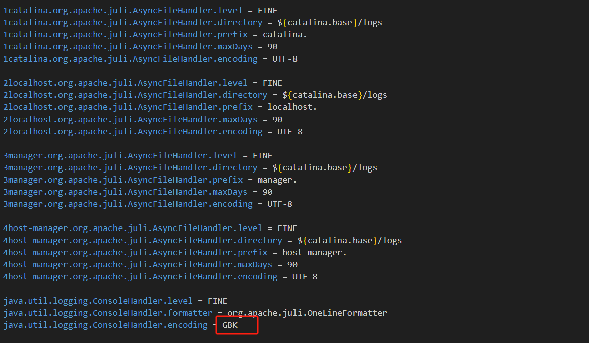
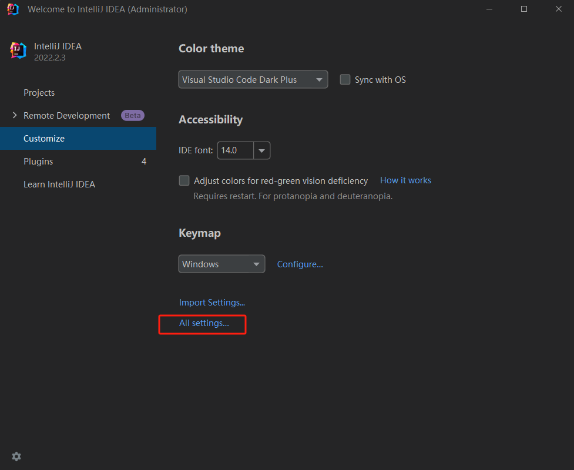
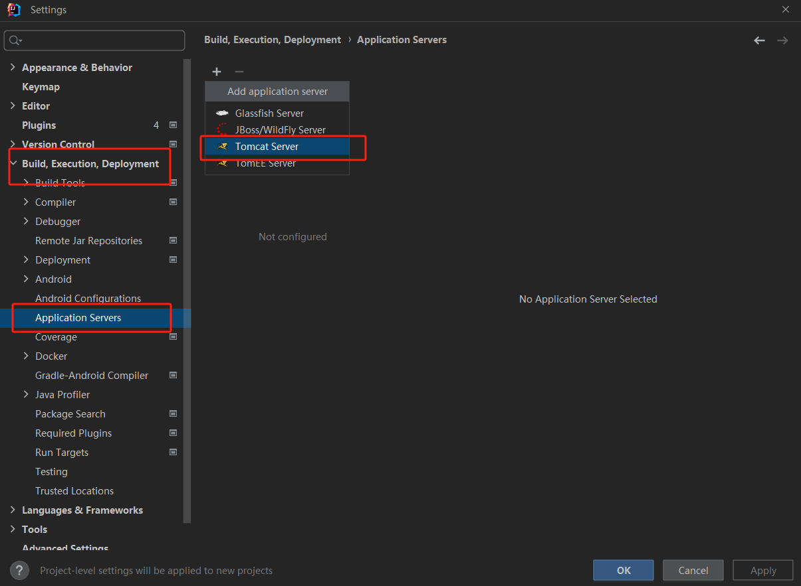
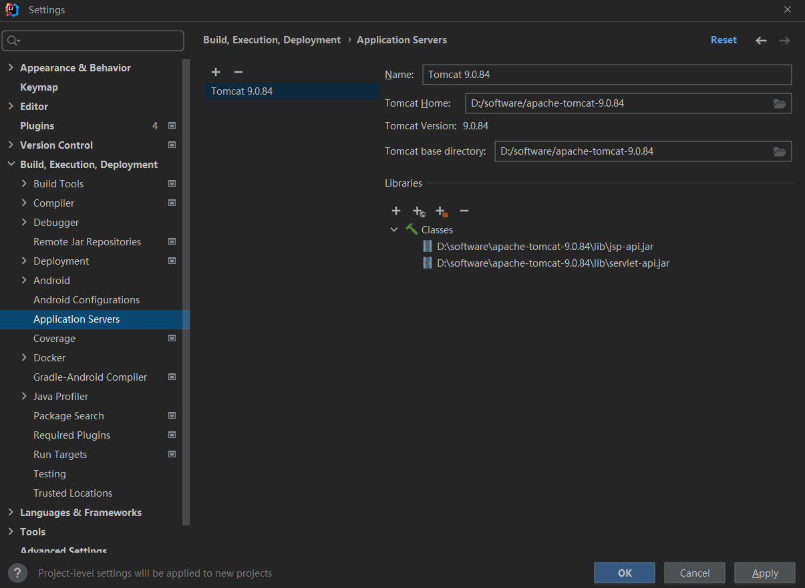
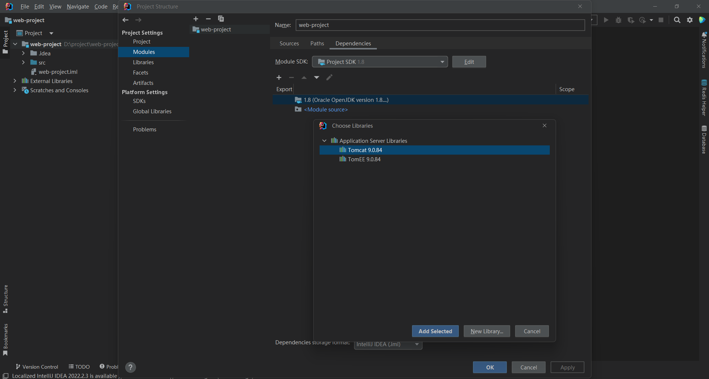
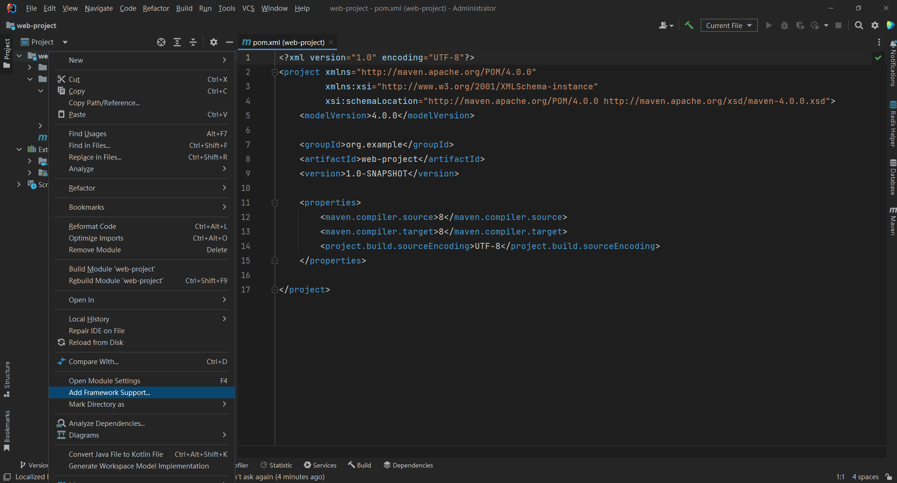
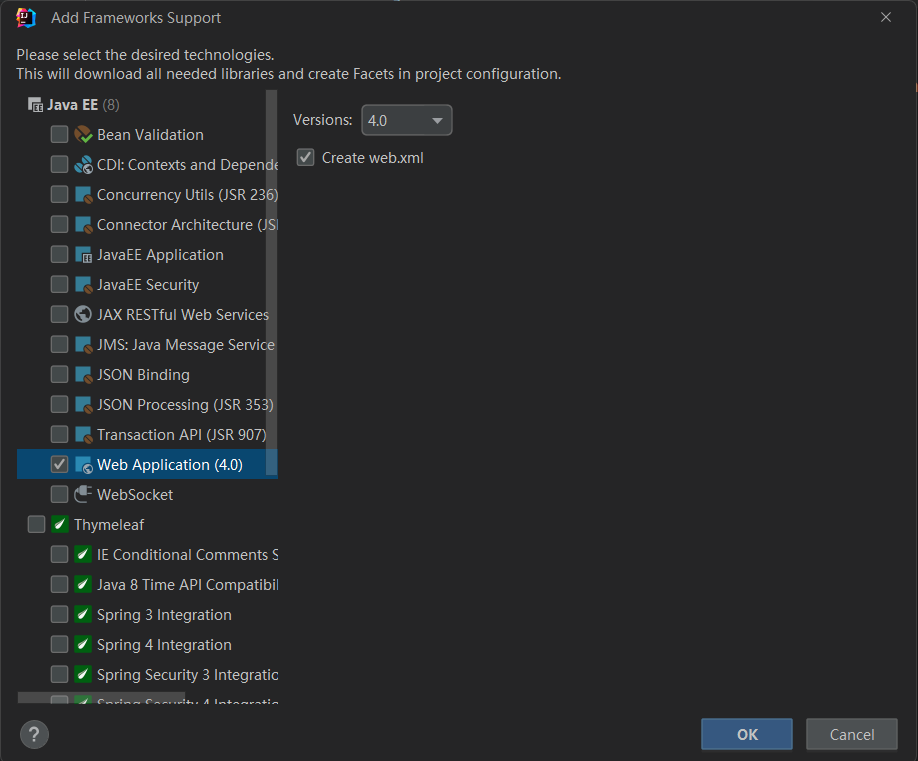

---
title:IDEA中集成Tomcat服务器
icon: laptop-code
date: 2023-12-15
star: true
order: 1
category:
  - Tools
tag:
  - Tomcat
  - IDEA
---

## 1.下载安装Tomcat

- Tomcat下载地址:[Apache Tomcat® - Apache Tomcat 10 Software Downloads](https://tomcat.apache.org/download-10.cgi)

- windows系统，选择如下：

- Tomcat解压安装

- Tomcat需要JDK的支持，配置JDK的环境变量

  

- 解决乱码问题

## 2. IDEA集成Tomcat

- IDEA关联本地Tomcat

- 为项目添加tomcat依赖

