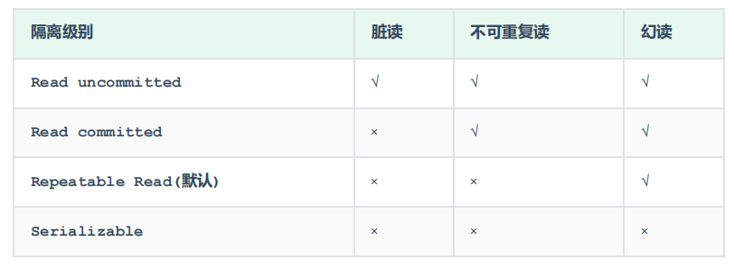

​	事务是一组操作的集合，它是一个不可分割的工作单位，事务会把所有的操作作为一个整体一起向系统提交或撤销操作请求，即这些操作要么同时成功，要么同时失败。本文以MySQL为例讲解事务。

<!-- more -->

## 1. 事务的简介

- 事务是一组操作的集合，这组操作集合要么同时执行成功，要么同时执行不成。
- 例如： 张三给李四转账1000块钱，张三银行账户的钱减少1000，而李四银行账户的钱要增加1000。 这一组操作就必须在一个事务的范围内，要么都成功，要么都失败。

> 注意： 默认MySQL的事务是自动提交的，也就是说，当执行完一条DML语句时，MySQL会立即隐式的提交事务。

- 查看事务提交方式，并设置手动提交

```sql
SELECT @@autocommit ;
SET @@autocommit = 0 ;
```

- 提交事务

```sql
COMMIT;
```

- 回滚事务

```sql
ROLLBACK;
```

> 注意：上述的这种方式，我们是修改了事务的自动提交行为, 把默认的自动提交修改为了手动提交, 此时我们执行的DML语句都不会提交, 需要手动的执行commit进行提交。

- 开启一个事务

```sql
START TRANSACTION 或 BEGIN ;
```

- 举例

```sql
-- 开启事务
start transaction
-- 1. 查询张三余额
select * from account where name = '张三';
-- 2. 张三的余额减少1000
update account set money = money - 1000 where name = '张三';
-- 3. 李四的余额增加1000
update account set money = money + 1000 where name = '李四';
-- 如果正常执行完毕, 则提交事务
commit;
-- 如果执行过程中报错, 则回滚事务
-- rollback;
```

## 2. 事务的四大特性

事务的四大特性，简称ACID。

- 原子性（Atomicity）：事务是不可分割的最小操作单元，要么全部成功，要么全部失败。

- 一致性（Consistency）：事务完成时，必须使所有的数据都保持一致状态。

- 隔离性（Isolation）：数据库系统提供的隔离机制，保证事务在不受外部并发操作影响的独立环境下运行。
- 持久性（Durability）：事务一旦提交或回滚，它对数据库中的数据的改变就是永久的。

## 3. 并发事务问题

- 赃读：一个事务读到另外一个事务还没有提交的数据。（B读取到了A未提交的数据）

  

-  不可重复读：一个事务先后读取同一条记录，但两次读取的数据不同，称之为不可重复读。（事务A两次读取同一条记录，但是读取到的数据却是不一样的）


- 幻读：一个事务按照条件查询数据时，没有对应的数据行，但是在插入数据时，又发现这行数据已经存在，好像出现了 "幻影"。


## 4. 事务隔离级别

为了解决并发事务所引发的问题，在数据库中引入了事务隔离级别。主要有以下几种：



- 查看事务隔离级别

```sql
SELECT @@TRANSACTION_ISOLATION;
```

- 设置事务隔离级别

```sql
SET [ SESSION | GLOBAL ] TRANSACTION ISOLATION LEVEL { READ UNCOMMITTED |
READ COMMITTED | REPEATABLE READ | SERIALIZABLE }
```

---

> 注意：事务隔离级别越高，数据越安全，但是性能越低。

---
