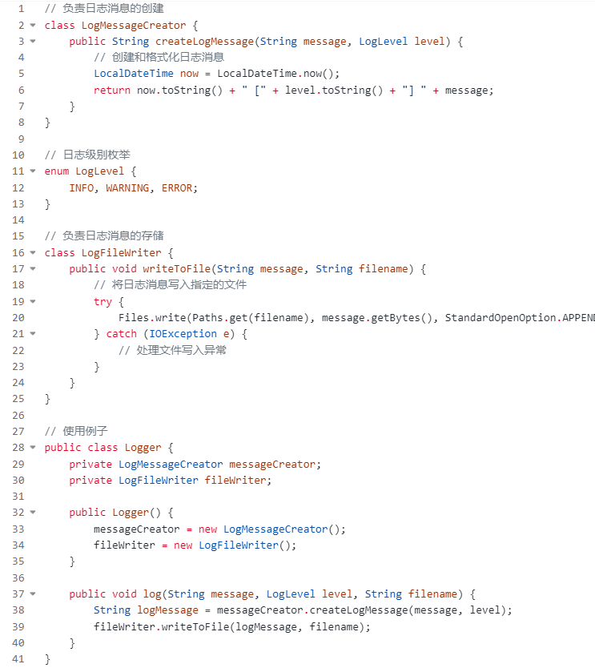
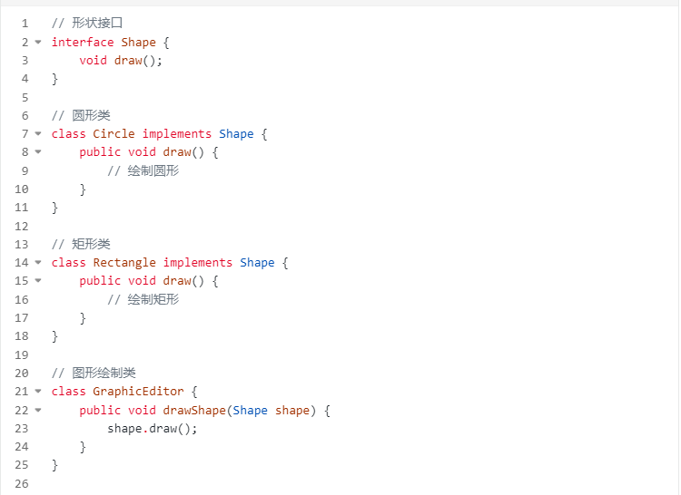
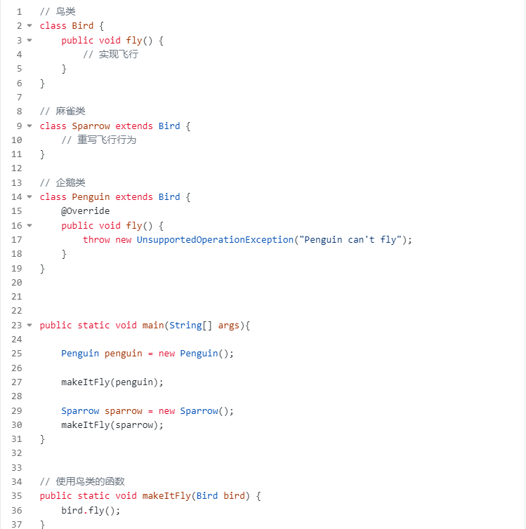
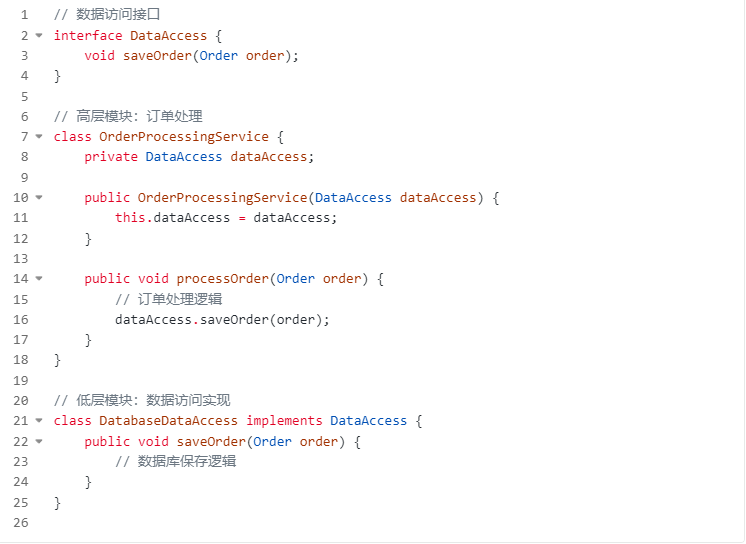
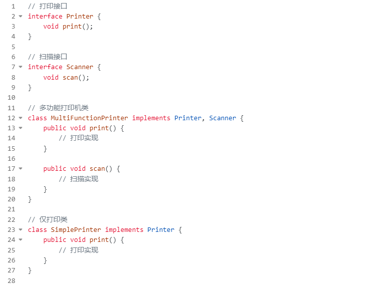

### 1.面向对象的三大基本特征

#### 1.1.封装
封装就是把现实世界中的客观事物抽象成一个Java类，然后在类中存放属性和方法。如封装一个 汽车 类，其中包含了 发动机、轮胎、底盘 等性，并且有 启动、前进 等方法。
#### 1.2.继承
像现实世界中儿子可以继承父亲的财产、样貌、行为等一样，编程世界中也有继承，继承的主要目的就是为了复用。子类可以继承父类，这样就可以把父类的属性和方法继承过来。
颜色 等属性，奔跑 等行为。如Dog类可以继承Animal类，继承过来巴吃东西
#### 1.3.多态
多态是指在父类中定义的方法被子类继承之后，可以通过重写，使得父类和子类具有不同的实现，这使得同一个方法在父类及其各个子类中具有不同含义。

### 2.面向对象的五大基本原则

#### 2.1.单一职责原则(Single-Responsibility Principle)
- 内容:一个类最好只做一件事
- 提高可维护性:当一个类只负责一个功能时，其实现通常更简单、更直接，这使得理解和维护变得更容易。
- 减少代码修改的影响:更改影响较小的部分，因此减少了对系统其他部分的潜在破坏。
- 代码：

#### 2.2.开放封闭原则(Open-Closed principle)
- 内容:对扩展开放、对修改封闭
- 促进可扩展性:可以在不修改现有代码的情况下扩展功能，这意味着新的功能可以添加，而不会影响旧的功能。
- 降低风险:由于不需要修改现有代码，因此引入新错误的风险较低。
- 代码:

#### 2.3.里氏替换原则(Liskov-Substituion Principle)

- 内容:子类必须能够替换其基类
- 提高代码的可互换性:能够用派生类的实例替换基类的实例，使得代码更加模块化，提高了灵活性。
- 增加代码的可重用性:遵循LSP的类和组件更容易被重用于不同的上下文。
- 代码：

#### 2.4.依赖倒置原则(Dependency-Inversion Principle)
- 内容:程序要依赖于抽象接口，而不是具体的实现。
- 提高代码的可测试性:通过依赖于抽象而不是具体实现，可以轻松地对代码进行单元测试。
- 减少系统耦合:系统的高层模块不依赖于低层模块的具体实现，从而使得系统更加灵活和可维护。
- 代码：

#### 2.5.接口隔离原则(Interface-Segregation Principle)
- 内容:使用多个小的专门的接口，而不要使用一个大的总接口
- 减少系统耦合:通过使用专门的接口而不是一个大而全的接口，系统中的不同部分之间的依
- 性减少了提升灵活性和稳定性:更改一个小接口比更改一个大接口风险更低，更容易管理。
- 代码：

