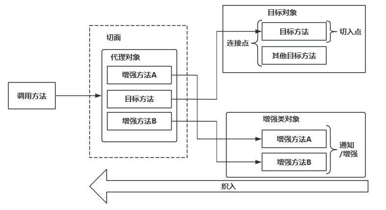

AOP（Aspect Oriented Programming），面向切面编程，它是面向对象编程的一种补充和完善，它以通过预编译方式和运行期动态代理方式实现，在不修改源代码的情况下，给程序动态统一添加额外功能的一种技术。利用AOP可以对业务逻辑的各个部分进行隔离，从而使得业务逻辑各部分之间的耦合度降低，提高程序的可重用性，同时提高了开发的效率。

<!-- more -->

## 1. 动态代理

- 代理模式时二十三种设计模式中的结构型模式，通过提供一个代理类，让我们在调用目标方法的时候，不再是直接对目标方法进行调用，而是通过代理类**间接**调用。
- 作用：
  - 代码解耦：让不属于目标方法核心逻辑的代码从目标方法中**解耦**。
  - 访问控制：调用目标方法时先调用代理对象的方法，减少对目标方法核心的修改。
  - 功能增强：同时附加对用目标方法增强的功能。
- 图示如下：

- 代理模式分为静态代理和动态代理两种
  - 静态代理：是对某类目标方法定制增强的代理类，当目标类增加了，代理类可能也需要成倍的增加。 代理类数量过多，不具有任何的灵活性。
  - 动态代理：在运行期间，对目标对象的方法进行增强，代理对象同名方法内可以执行原有逻辑的同时嵌入执行其他增强逻辑或其他对象的方法（Java使用JDK的反射机制，创建代理类对象， 并动态的指定要代理目标类）

## 2. AOP原理

### 2.1 AOP的理解

- AOP思想是对面向对象编程OOP的升华。OOP是纵向对一个事物的抽象，一个对象包括静态的属性信息，包括动态的方法信息等。而AOP是横向的对不同事物的抽象，属性与属性、方法与方法、对象与对象都可以组成一个切面。切面分散在每个各个模块中解决同一样的问题，如用户验证、日志管理、事务处理、数据缓存都属于切面关注点。从每个方法中抽取出来的同一类非核心业务。
- AOP通过预编译方式和运行期动态代理方式实现，在不修改源代码的情况下，给程序动态统一添加额外功能的一种技术。
- AOP可以对业务逻辑的各个部分进行隔离，从而使得业务逻辑各部分之间的耦合度降低，提高程序的可重用性，同时提高了开发的效率。

- 如上图所示，代理类通过调用业务的方法，在不修改业务方法本身的情况下为其添加事务功能和日志记录功能的增强。

### 2.2 AOP相关术语

- 目标对象（Target）：被增强的方法所在的对象。
- 代理对象（Proxy）：对目标对象进行增强后的对象，客户端实际调用的对象。
- 连接点（Joinpoint）：目标对象中可以被增强的方法。
- 切入点（Pointcut）：目标对象中实际被增强的方法。
- 通知\增强（Advice）：增强部分的代码逻辑。
  - 前置通知：在被代理的目标方法**前**执行
  - 返回通知：在被代理的目标方法**成功结束**后执行（**寿终正寝**）
  - 异常通知：在被代理的目标方法**异常结束**后执行（**死于非命**）
  - 后置通知：在被代理的目标方法**最终结束**后执行（**盖棺定论**）
  - 环绕通知：使用try...catch...finally结构围绕**整个**被代理的目标方法，包括上面四种通知对应的所有位置
- 切面（Aspect）：增强和切入点的组合。
- 织入（Weaving）：将通知和切入点组合动态组合的过程。

