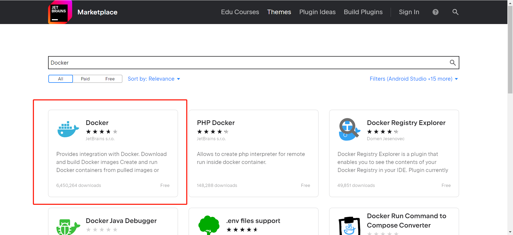
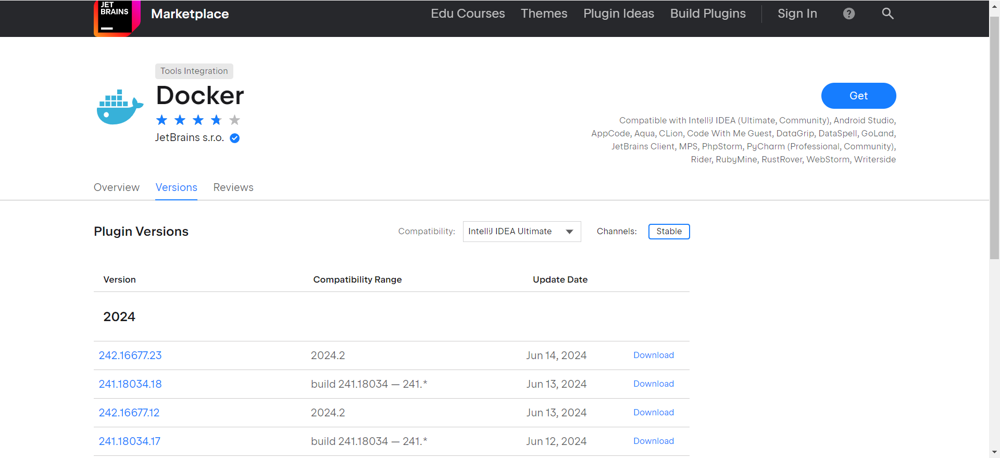
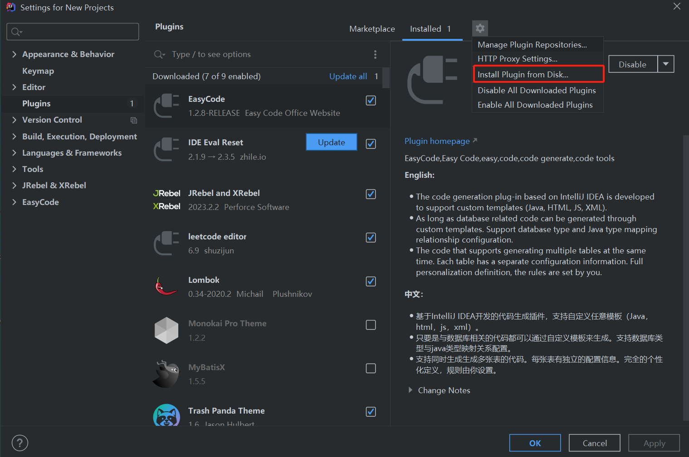

使用IDEA编辑器离线安装Docker插件

<!-- more -->

## 1.下载Docker插件

- 插件下载的官网：[https://plugins.jetbrains.com/](https://plugins.jetbrains.com/)

- 选择docker插件

- 选择docker版本

## 2. IDEA安装插件

- File->Setting->Plugins->install->Install Plugin from Disk

  